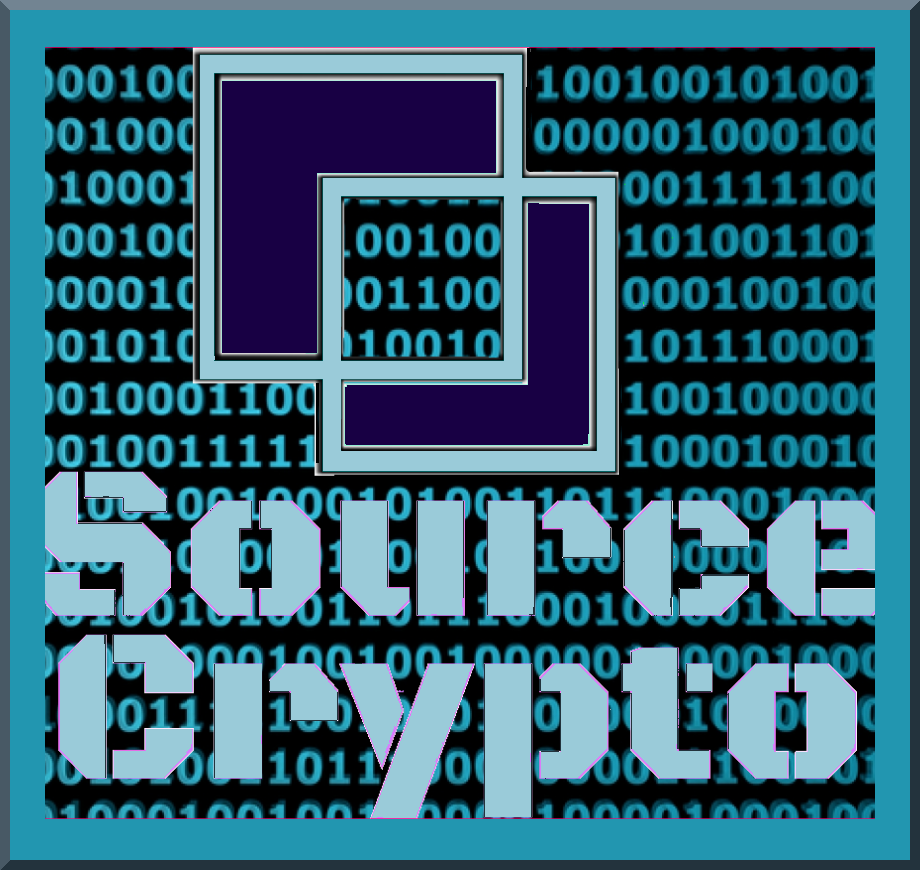

**Collecting and Cataloging Quality\Valuable Information, in conjunction with the SuperSource Discord chat.**

With the help of some friends (hint hint :) I'm working to create a collaborative web-directory of "source-grade" content, both searchable and manually navigable by tags. For writers, students, and research nerds to more easily find information on the topics we're studying at any given moment. 




The problem is that information is not so neatly organized, since each subject is related to the others. I **could** make a page that goes in-depth on every subject, but then I'd be re-producing the same information over and over in a bunch of different places. We need a properly tagged database, so that the information displayed is adjusted depending upon my query.. rather than hard coding categories by sheer force of will.


### A Machine Readable Repository on Every Subject In Crypto.

Originally organized in the channels of a [discord server](http://crypt0library.net), this is a landing pad in the process of making a machine readable repository of information on every subject in crypto.

* [Source⧉Crypto](https://discord.gg/ahTuPMY) - I collect and categorize links in here, on the fly.

* [infominer33/SourceCrypto](https://github.com/infominer33/SourceCrypto) - Later I enter the links into machine readable TOML format.

Even further down the line, those links get organized some more, and added to the human-readable .md files of various github repositories.


Now we're, here, and I'm building web-pages around all of it. I didn't plan it that way, but it's all coming together nicely. 

At some point, I will need an app (or a few scripts) to grab all links from the files in a repository, check them against our database, and output a list of links that need to be added.

### [Source⧉Crypto](http://crypt0library.net) Discord Directory [**^**](#research-index)


It's quite navigable, using `ctrl+k` (in the desktop app), or by using the channel directory I've made in-server.

**General Knowledge**

\#101, #history, #satoshi, #wallets, #exchanges, #cypherpunk, #icos, #evaluation, #economics, #governance, #trading, #mining, #regulation, #walstreet, #wallets, #growth-adoption, #traditional-finance, #classification, 

**Resources**

\#resources, #assorted-media, #twitter-follows, #communities, #news-sites, #swag, #women, #earn-crypto, #conferences, #books, #research-papers, #non-english, #data, #send-crypto

**Crypto**

\#gen-crypto, #bitcoin, #btc-layer2, #ethereum, #eth-layer2, #eth-consensus, #stable-coins, #doge, #zcash, #cardano, #stellar, #ripple, #tron, #bch, #dash, #litecoin, #monero, #iota, #neo, #etc, #steem, #eos, #bitshares, #nano, #hyperledger, #corda, #etcetera, #bytom, #tezos, #cosmos, #enterprise-dlt, #grin-mimblewimble, #blockstack, #central-bank-digital-currency

**Tech**

\#cryptography, #decentralization, #privacy, #security, #protocols, #hash-algos, #open-source, #forks, #smart-contracts, #dapps, #sidechains, #master-nodes, #databases, #ipfs, #tor, #pi-rasberry, #bittorrent, #oracles, #interoperability, #identification, #p2p, #drivechains, #internet-protocols 

**Distributed Consensus**

\#distributed-systems, #consensus, #pow, #pos, #tendermint, #hashgraph, Development, #discussion-dev, #hackathons, #gen-developing, #blockchain-developing, #forking, #bitcoin-dev, #ethereum-dev, #state-channels, #id-dev, #corda-dev, #steem-dev, #hyperledger-dev, #quant-trading, #nano-dev, #cardano-dev, #design

**Application**

\#security-tokens, #identity-did, #finance, #payment-processing, #institutional-derivitives, #prediction-markets, #dao, #fiat-onramp, #publishing, #united-nations, #government, #voting, #supplychain, #social-media, #music, #art-collectibles, #iot, #ai, #intellectual-propery, #games, #energy, #services, #marketplaces, #notary, #criminal, #bots, #utility, #china, #crypto-selfregulation

<b><a href="https://discord.gg/ahTuPMY" target="_blank">discord.gg/ahTuPMY</a></b>

## Source⧉Crypto Demo

[](supersource-demo.mp4)

This is a really basic demo of what we're working to create.

## [Source⧉Crypto Discord](http://crypt0library.net)

In order to create the database to power our dynamic web-portal, I'm using the [TOML format](https://github.com/toml-lang/toml) to organize the information and describe it and tag it. TOML is a simple format that we are using to prepare our information to be transformed into a mongo database. 

I've scraped the server, and copied all of its contents into files in this repository. Once transformed into TOML, many of them will be made into their own pages. It's all part of the process, gather, organize, gather more.
  
### The Format

```
["The **Title** of the entry and must always be different from previous entries"] 
Link = ["https://Blah.com"]
Description = "Description can be whatever text is valuable to communicate.\nTypically copied directly from the source; sometimes requiring creativity. "
Tags = ["blah", "blah-blah"]
```

>* **For any label that can potentially have multiple values it must always be ["bracketed"] even though sometimes there is only one value.**
>* **I made "Link" a bracketed ["array"] so that sometimes a supporting link can be included. occasionally this will be helpful.**
>* **Also, all entries have to have the same fields and format**
>* **If you use \n for a newline, you can't actually use a newline, the open " and closing " must be on the same line**
>* **Be careful of quotation marks in text copied descriptions. Change to ' or use an escape character \\" in front of the quotation mark**
>* **TOML is Case Sensitive. All the tags should be lower case. All the value names must always begin with a capital and be identical**


The result of this process, once it's landed on github ^^^

### Tagging

Tagging is a complex topic. We need enough unique tags to make this directory ideally navigable, and to use a consistent schema for tagging over the course of this project. If you are jumping in and getting involved, just tag as best you can, I'll be going over the tagging many times.

Once this project is living in a web app it will become a more streamlined collaborative process: so that tags can be suggested and also flagged as unhelpful. 

To be clear these are app specific tags that users will be able to create and navigate via. Not every possible keyword, that will come later on another layer.

See "[tag-definitions.md](/toml/tag-definitions.html)" for more information. Feel free to join in on the fun :)

<a href="https://github.com/infominer33/SourceCrypto">View on GitHub</a>


---
### Tips Jar 

BTC— 1GvkjHtiy9LUjVkStnEAXxjhcoS56aCokY

 

DOGE— DSzMxfABB8EwKiumzV7YHhS7HTvWAyM7QF

 
